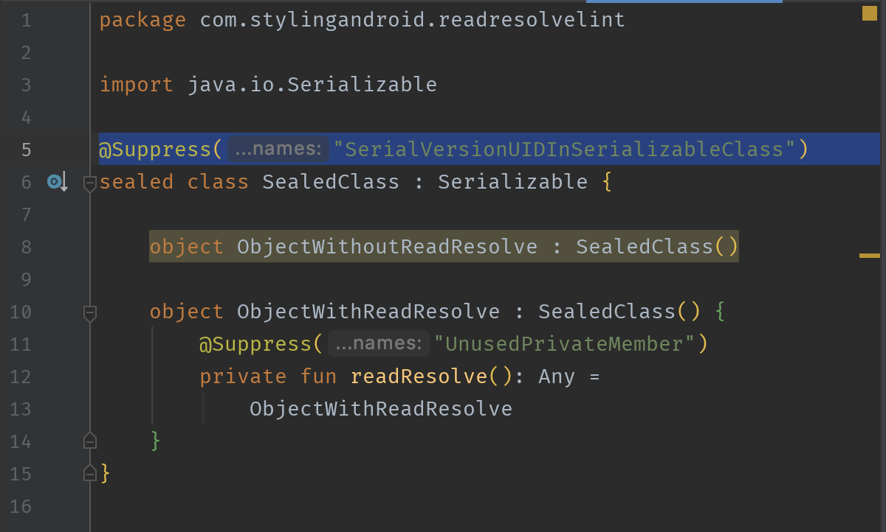
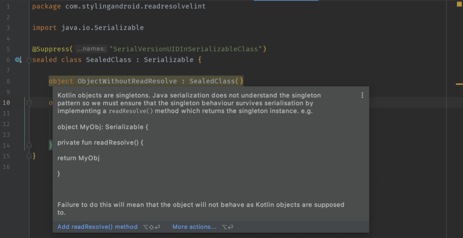
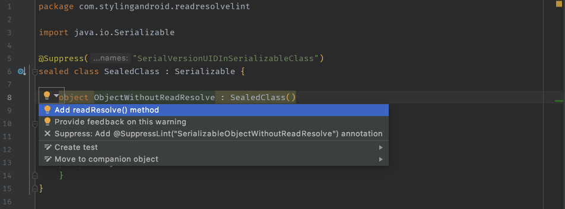

# Read Resolve Check


A lint check which identifies Serializable Kotlin objects which do not implement a `readResolve()` 
method. An explanation of why this is necessary can be found 
[here](https://blog.stylingandroid.com/kotlin-serializable-objects/).

## Usage

The lint check library is deployed to jCenter so you'll need to ensure that this is included in 
your build script repositories so ensure that your top level build script contains:

```groovy
repositories {
    jcenter()
}
```

Then add it as a dependency to the build script for each module that you want the lint check to be 
applied to:

```groovy
dependencies {
    .
    .
    .
    lintChecks "com.stylingandroid:read-resolve-check:1.0.0"
}
```

The lint check will now be included when lint checks are run on the project.

If the problem is detected it will add a warning to the lint report but also show within the IDE:


Hovering over the warning will give a more detailed description:


There will also be the an option to add a fix in the suggestions popup menu:



## Issues
Please report any issues in either the detection itself or the fix implementation using the 
[issue tracker](https://github.com/StylingAndroid/ReadResolveCheck/issues). Please include a code
snippet which can be used to reproduce the issue.

## License

Read Resolve Check is released under an [Apache 2 license](./LICENSE.md)

Copyright © 2020 Mark Allison
